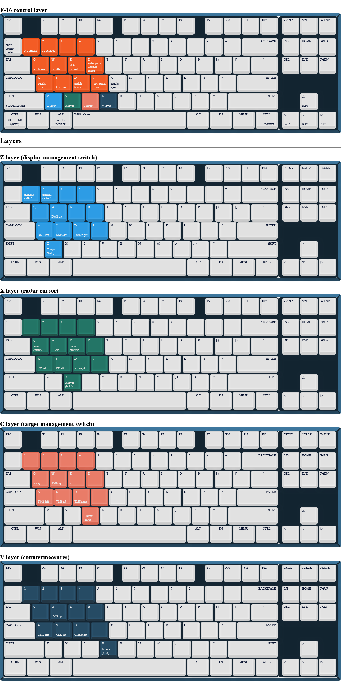
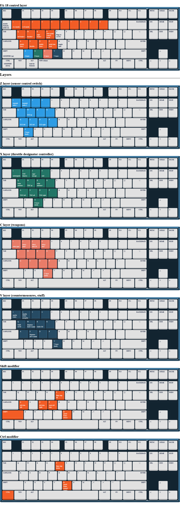
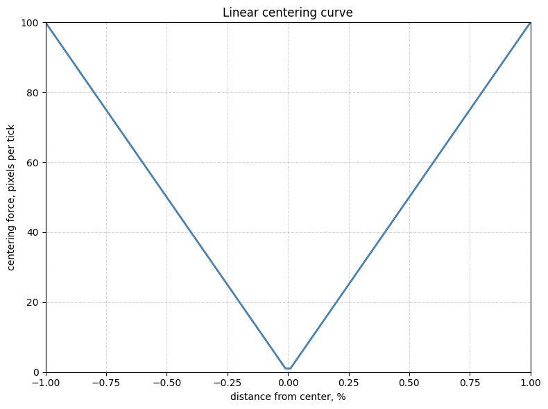
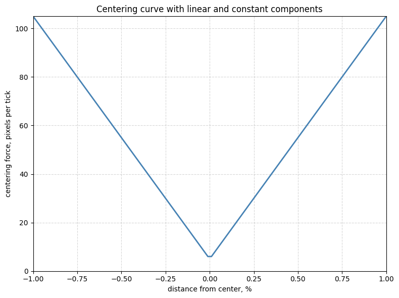

# So you want to play DCS with keyboard and mouse? No problem.

> This page is work in progress

Contrary to popular belief, keyboard and mouse controls in DCS can be both enjoyable and competitive with hotas setups when done right. This repository aims to make flying in DCS using mouse and keyboard easy and effective using a FreePIE script. It also aims to explain where keyboard and mouse fall short of hotas and how to compensate for those shortcomings.

Features:

- Profiles for different aircraft
- Separated mouse pitch/roll trim behavior and curves
- Simple keyboard layers to access all keybinds without moving your left hand from WASD position
- Clickable cockpit mode for easy interaction with cockpit and alt-tabbing
- Pedal control mode for easy taxi and takeoff

Table of contents:

- [1. FAQ](#faq)
- [2. Getting started](#getting-started)
- [3. Script features & documentation](#script-features--documentation)
  - [3.1 Script layer topology](#script-layer-topology)
  - [3.2 Aircraft mouse behavior and keybinds](#aircraft-mouse-behavior-and-keybinds)
  - [3.3 F-16 keybinds](#f-16-keybinds-wip)
  - [3.4 FA-18 keybinds](#fa-18-keybinds-more-wip)
- [4. Designing the perfect joystick mouse controls](#designing-the-perfect-joystick-mouse-controls)
  - [4.1 The problem](#the-problem)
  - [4.2 Mapping mouse speed to joystick position](#mapping-mouse-speed-to-joystick-position)
  - [4.3 The two solutions](#the-two-solutions)
  - [4.4 Adjusting the curve variables](#adjusting-the-curve-variables)
  - [4.5 Pitch vs roll centering](#pitch-vs-roll-centering)
- [5. Demo clips](#clips)
- [6. About this repo](#about-this-repo)

## FAQ

**How competitive is it with HOTAS?** Very competitive for fixed wing aircraft. By the time you are ready to start playing multiplayer, you should be able to do 90%-110% of what a HOTAS player can do. I consider helicopters playable but less enjoyable and maybe 80% as competitive as HOTAS.

...When it comes to flying and PVP, of course. Keyboard and mouse will never be as immersive as having a physical stick if you're aiming for realism.

---

**What hardware do I need for flying?** Mouse and keyboard to get started. I wouldn't play without head tracking also, for this you need a webcam or a phone.

---

**What software do I need for flying?** [FreePIE](https://andersmalmgren.github.io/FreePIE/), vJoy and [Opentrack](https://github.com/opentrack/opentrack) for head tracking.

<details>

<summary>What do these programs do? (click to expand)</summary>

FreePIE is a program that allows you to create custom scripts to map your input devices to virtual joysticks and other output devices. In this case, we will use it to map our keyboard and mouse inputs to a virtual joystick that DCS can recognize.

vJoy is a virtual joystick driver that creates virtual joystick devices on your computer. In other words, it acts as if you had a physical joystick connected to your computer that will show up in DCS. You can control the virtual stick programmatically using FreePIE.

</details>

---

**Do I need to know how to program?** Not really, if you want to just use the script. If you want to customize it, yes or just ask AI to modify it.

---

**What modules work the best with M&K?**

<details>

<summary>Fly-by-wire aircraft and helicopters (click for more details)</summary>

## What modules work the best with M&K?

I've tried the following:

- F-16: FBW, works really well.
- F/A-18: FBW, works really well.
- A-4E-C: No FBW. You can fly it well, although the slight inaccuracy of virtual joystick placement puts you at a small disadvantage compared to HOTAS players.

- UH-60L: Automatic flight control system (AFCS) and the big size makes it really easy to fly with mouse and keyboard. (I'd imagine apache is the same)
- OH-6A: No flight assistance. Pretty rough, but playable and learnable.
- UH-1H: No flight assistance. Pretty rough, but playable and learnable.

In general: fixed wing aircraft that have fly-by-wire controls work very well and don't put you at a disadvantage compared to HOTAS players. Older models have a bit steeper learning curve and require more muscle memory and precision so that you don't stall in turns. Helicopters are playable but the older models that lack all flight assistance will require quite a lot of dedication. You'll also need to bind the pedals to your mouse wheel for sufficient yaw control.

</details>

## Getting started

1. Download and install [FreePIE](https://andersmalmgren.github.io/FreePIE/), [vJoy](https://sourceforge.net/projects/vjoystick/) (and [Opentrack](https://github.com/opentrack/opentrack) for head tracking)

2. Download the [FreePIE script](DCS.v1.py) from this repository.

3. Use vJoy configurator to create two virtual joysticks. The first should have ~128 buttons. The second is needed for additional axes.

4. Open the script in FreePIE, press F5 to run the script.

5. When you start it, no module is selected. To select F16 module (I use it for both F-16 and FA-18), press K+5. K+number allows you to configure different behavior for different aircraft and helicopters, and switch between them on the fly.
   - The "view" debug console shows you some useful variables such as module you have enabled and whether you are in freelook mode

6. Update your DCS keybinds. The script utilises 4+1 keyboard layers that map to virtual joystick buttons, see below for detailed explanation. You need to unbind all the layered keys and then rebind them under the virtual joystick's buttons. For example, if you want to bind X+W to RCS up, in DCS unbind W from everything, then click add bind under the virtual joystick and press the key combination. You should see JOY_BTN[NUMBER] bound.
   - Keys WASDQE in the default layer are used for axis, you can't rebind them without modifying the script.

<!-- ## What controls does a typical HOTAS have?

Skip this section if you are already familiar with typical HOTAS controls. -->

## Script features & documentation

This section explains in detail how to use the script.

### Script layer topology

The script has 3 layers of logic as pictured below: profiles, control modes, and Z-V keyboard layers.

```
.
├── UH-60L (K+1)
│   └── ...
├── UH-1H (K+3)
│   └── ...
├── F-16/FA-18 (K+5)
│   ├── "Freelook" mode (Mouse 5)
│   └── Control mode (GRAVE key, next to 1 key)
│       ├── Pedal control mode (R, GRAVE to exit to default control mode)
        └── Z-V layers (hold layer key to enable)
```

1. **Profiles** are the top level layers. Each profile has different mouse curves and control behavior for different aircraft. You can switch between profiles on the fly by pressing `K + number`. When you start the script, no profile is selected.

2. When you have a profile selected, you can toggle between **freelook mode** and **control mode** using `Mouse 5` and `GRAVE`.
   - In freelook mode, your mouse is detached from the virtual joystick, cockpit clickable cursor is enabled and keyboard shortcuts are disabled. Enable freelook if you want to interact with cockpit, look at f10 map or alt-tab out of the game.
   - In control mode, your mouse controls the virtual joystick and keyboard shortcuts are enabled. You can enable pedal control mode.

3. Pedal control mode is a submode of control mode where your mouse controls your pedals instead of pitch and roll. Use this for taxi and takeoff. To enable it, press `R` while in control mode. To exit it, press `GRAVE` to go back to default control mode.

4. **Z-V keyboard layers** can be accessed while in control mode.

### Aircraft mouse behavior and keybinds

**Mouse curves and behavior**

- Pitch is always trimmed, in other words when you don't move your mouse, the virtual joystick's pitch will stay where you left it.
- When Mouse 4 is held, pitch is trimmed to center. Use this when you want to move your pitch perfectly center.

- Roll is always trimmed to center.
- shift + A/D and shift + F can be used to trim the roll or reset the trim to center.
- Small constant rate and medium linear rate center the roll to trim location at all times.

https://github.com/user-attachments/assets/cd6dbf61-f284-4e64-baed-f5deeb9e877a

**Mouse keybinds**

- Mouse 1: gun
- Mouse 2 (F-16): enable btn (held)
- Mouse wheel: zoom, press toggles between 2 zoom levels
- Mouse 4: hold to trim pitch to center, or trim pedals to center if in pedal control mode
- Mouse 5: enter freelook mode (disable all keybinds, detach mouse from joystick, enable clickable cockpit)

### F-16 keybinds (wip)

**Keyboard keybinds**



The rest of the keyboard uses the default DCS keybinds.

### FA-18 keybinds (more wip)

- CTRL + T: 3-way flaps AUTO -> HALF -> FULL
- Shift + T: 3-way flaps FULL -> HALF -> AUTO
- T: 3-way flaps to AUTO

- CTRL + B: hold to extend speed brake
- SHIFT + B: press to retract speed brake



## Designing the perfect joystick mouse controls

This section is about the theory behind efficient joystick emulation using a mouse. It should also help you adjust the mouse curves for the best experience.

### The problem

In order to understand what are the optimal mouse curves and control behavior, one needs to understand the differences between mouse and joystick as input devices. What the joystick does that the mouse doesn't:

- Joystick gives you physical feedback on where you are with respect to the center and max limits, because it has a fixed range of motion.

On the other hand, mouse gives you:

- Configurable sensitivity and higher precision, especially compared to budget joysticks.

An important thing to note here is that in between the center and max limits, the joystick acts pretty much the same as a relative input device like a mouse. If you can get feedback on where your mouse is with respect to the virtual joystick center and max limits, you can do anything that a real joystick can do.

### Mapping mouse speed to joystick position

One solution to the lack of physical feedback is to map mouse speed to joystick position directly. You can do this with the following formula:

`joystick_position = min(mouse_delta / sensitivity, max_limit)`

...where the mouse delta is the distance you've moved since the last tick (update). You'd also apply moving average smoothing to the mouse delta.

This makes it so that if moving your mouse at X pixels per second corresponds to max joystick deflection, moving the mouse at X/2 pixels per second corresponds to half deflection and letting go of the mouse would center the stick almost immediately.

The problem with this approach is that your brain is way better at controlling how far you've moved your hand than how fast your hand is moving. I tried this approach and while it did fix the lack of feedback, it was way too inaccurate to be able to hold a specific joystick position even after applying smoothing to the speed input.

### The two solutions

The solution(s) to our problem exploit the fact that you only need precise control over the joystick near the center. This means that the closer to the max limit you are, the more you can control the stick using the speed of your mouse movement without suffering from the inaccuracy of speed control. Near the center you need to be able to have very precise control, meaning that the input method should be relative and not based on speed. This would naturally give us the following curve:



Now it's easy to get feedback when you are near the max limit, but another problem remains. When trying to center the stick from a high deflection, the stick won't center perfectly because the centering force gets exponentially weaker the closer you are to the center. For this reason, we need to add a small constant centering force that is applied at all times, so that the virtual stick will always perfectly center itself even if you don't quite hit the center. Together these curves look like this:



We want to keep the curve as simple as possible (hence the linear shape) because accurate mouse joystick emulation relies on muscle memory and intuition of the virtual joystick position. Even if a more complex curve would give you better theoretical performance, it's not worth it for the much increased learning time.

### Adjusting the curve variables

The above curves use example values. To find the optimal curve variables you can use the following logic:

- The bigger the linear component, the less your mouse acts like relative input and the more feedback you get about how far you are from the joystick max limit. If you increase it too much, you lose precision and can run out of mouse pad when trying to hold a large deflection. Try to have set it as large as possible while being able to do 95% of the mouse movements with only your wrist. Lifting your arm always results in less precise movements.

- The bigger the constant centering force, the easier and quicker it will be to center the stick. However, you need to always overcome the constant component when moving the mouse, meaning that it sets a sort of minimum mouse speed that you need to meet to be able to move the stick at all. That's not great for precision, so I'd set it as low as possible without suffering from over or undershooting the center when returning from stick deflection. The magnitude of the constant component is a compromise between ease of centering and precision near the center.

### Pitch vs roll centering

I've found that it's best to use hold-to-enable centering for pitch and always center roll. This is because you want to be able to hold a specific pitch angle in a turn, where as roll never requires sustained hold at high deflection. Rather you'd initiate the turn with a roll and then apply a slight roll together with pitch to sustain it. After a turn you'd hold the pitch centering button while leveling the aircraft to perfectly hit the center of the stick.

If you need to manouver without looking forward, you can do it accurately by holding the pitch centering button so that it acts the same way as roll. Without visual feedback you are limited when it comes to holding a high pitch deflection accurately. This almost never matters though and you can practice it.

## Keyboard layers

When it comes to keybinds, K&M users are in luck. You will never have the issue of your hotas not mapping to your aircraft controls one to one. Your keyboard will never run out of buttons to bind, since you can multiply the number of available keys with layers and modifiers.

I use 4+1 layers for my keybinds in addition to shift and ctrl used as modifiers occasionally. This means the keys 1-4, Q-R and A-F behave differently depending on which of the keys Z-V is held down (I have dubbed the 5th layer (when nothing is held) as the _control layer_). In total this gives me 5 x 3 x 4 = 60 buttons that I can press without moving my left hand from the WASD position in addition to couple other non layered keys. Not too shabby.

DCS itself has partial support for layers, but it lacked some logic that I wanted to program in (such as hold to enable layer iirc), so the layered keys actually map to the virtual joystick's buttons 0-115. To map keys, you need to a) unbind keys 1-V from everything in DCS and b) when binding layered keys, bind them under the virtual joystick's buttons by pressing the desired key. Furthermore, the control layer contains axis bindings such as throttle and pedals that you can't rebind without modifying the script, but the rest of the layered keys are free to bind as you wish.

The keybinds are not complete and contain only the bare necessities to fly and fight. You might want to bind more of the buttons.

### What makes a good keyboard layout?

I designed my layout with the following in mind:

- Must be able to press all aircraft HOTAS keys without moving left hand from WASD position
- Must have enough keys to bind all HOTAS buttons (layers!)
- Different layers can't have keys that need to be pressed at the same time
- Must be intuitive to use and remember

### Why two keys for a single toggle (freelook)

## Flying helicopters with mouse and keyboard

- Bind pedals to mouse wheel
- Having a button in your mouse that doubles your dpi when held helps. This way you can have lower sensitivity for precision when hovering and higher sensitivity for forward flight.
- Helicopters that don't have fly-by-wire where you need to always hold some amount of roll will require you to enable continuous trim for both pitch and roll as opposed to just pitch.

## Clips

Some clips that demonstrate the accuracy that can be achieved with mouse and keyboard controls:

https://github.com/user-attachments/assets/d8cfc1b6-5361-40e1-9aa1-a54ff2a8993d

https://github.com/user-attachments/assets/50ba377a-6bc7-4888-86d2-e259131cbe4d

https://github.com/user-attachments/assets/9725a4e2-3b2b-471a-a2ff-d3ec70427224

https://github.com/user-attachments/assets/2a6d1d8a-7f4f-4601-a249-5581a641ccf1

## About this repo

Keybind diagrams were created using [keyboard shortcut map maker](https://archie-adams.github.io/keyboard-shortcut-map-maker/).

No AI was used to write this guide. Early versions of the script were AI generated.
